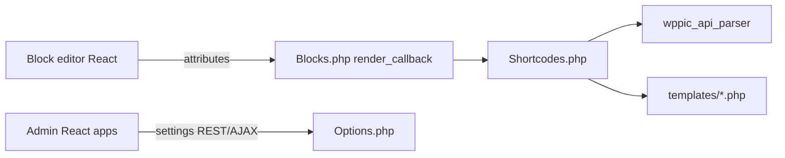

# Architecture

How WP Plugin Info Card is structured for developers.

User shortcode/block references remain on [DLX docs](https://docs.dlxplugins.com/product/wp-plugin-info-card/). This page covers the dual stack and why shortcodes still matter.

## High-level flow

**Production HTML is PHP.** React is used for the block editor, admin settings, and editor-only card previews.

## Bootstrap

[`wp-plugin-info-card.php`](../wp-plugin-info-card.php) loads Composer (`lib/autoload.php`), [`functions.php`](../functions.php), and instantiates `MediaRon\WPPIC\WP_Plugin_Info_Card`.

On `plugins_loaded`, modules boot including:

| Module | Role |
|--------|------|
| `Blocks` | Register blocks, enqueue editor assets, PHP `render_callback`s |
| `Shortcodes` | Shortcodes, much REST, card orchestration |
| `Add_Plugin` / `Add_Theme` | WP.org parsers + template registration |
| `GitHub` | GitHub API parser |
| `Import_Export` | Custom plugin CPT + public/admin REST |
| `TinyMCE\Init` | Classic editor shortcode UI |
| `Admin` / `Admin\Init` | Settings shell and tabs |
| `EDD` | Optional Easy Digital Downloads integration |

## What is React

| Area | Path | Build output |
|------|------|--------------|
| Gutenberg blocks | `src/blocks/*`, entry `src/index.js` | `build/wppic-blocks.js` |
| EDD editor sidebar | `src/plugins/EDD/` | `build/edd-sidebar.js` |
| Admin settings tabs | `src/react/views/{home,edd,custom-plugin,github-info-cards}/` | `dist/wppic-admin-*.js` |
| Editor card previews | `src/blocks/templates/*.js` | Bundled with blocks (not production HTML) |

Frontend scripts that are mostly **not** React:

- Lazy-load helpers under `src/js/` (e.g. GitHub cards, profile badges) using `@wordpress/api-fetch`
- Classic flip/AJAX behavior in `assets/js/wppic-script.js` (jQuery)
- TinyMCE inserter in `assets/js/wppic-ui-mce.js`

Blocks register with `save() { return null }` and rely on PHP for saved content.

## Why shortcodes remain

Shortcodes are intentional **compatibility**, not abandoned legacy.

- Product copy in [`readme.txt`](../readme.txt) calls out classic themes and page builders (Elementor, Divi, Beaver Builder).
- Shortcodes are the **canonical shared renderer**. Block `render_callback`s in [`php/Blocks.php`](../php/Blocks.php) map attributes and call [`php/Shortcodes.php`](../php/Shortcodes.php) (e.g. `info_card_render` → `Shortcodes::shortcode_function`).
- Classic Editor still inserts shortcodes via TinyMCE (`php/TinyMCE/`, `assets/js/wppic-ui-mce.js`).
- Script enqueue for classic pages is still driven by shortcode presence.

Do not remove shortcodes or invent a parallel frontend path without a migration that covers page builders.

### Shortcodes and matching blocks

| Shortcode | Block (namespace `wp-plugin-info-card/`) |
|-----------|------------------------------------------|
| `[wp-pic]` | `wp-plugin-info-card` |
| `[wp-pic-query]` | `wp-plugin-info-card-query` |
| `[wp-pic-site-plugins]` | `site-plugins-card-grid` |
| `[wp-pic-plugin-screenshots]` | `plugin-screenshots-info-card` |
| `[github-info-card]` | `github-info-card` |
| `[wp-pic-badges]` | `profile-highlights-badges` |

`github-info-card-grid` is a block wrapper (InnerBlocks); it is not a separate shortcode.

## Layouts and templates

Card `layout` values: `card`, `large`, `flex`, `wordpress`, `ratings`.

PHP templates under [`templates/`](../templates/) (plugin and theme variants), e.g.:

- `wppic-template-plugin.php` (default card)
- `wppic-template-plugin-large.php`
- `wppic-template-plugin-flex.php`
- `wppic-template-plugin-wordpress.php`
- `wppic-template-plugin-ratings.php`
- Matching `wppic-template-theme-*.php` files

Templates are selected via the `wppic_add_template` filter from `Add_Plugin` / `Add_Theme`.

React mirrors for the editor live in `src/blocks/templates/`. Changing one without the other causes editor/frontend drift — see [`history-and-debt.md`](history-and-debt.md).

## Data sources

| Source | Entry |
|--------|--------|
| WordPress.org plugins | `php/Add_Plugin.php` → `plugins_api()` |
| WordPress.org themes | `php/Add_Theme.php` → `themes_api()` |
| Custom plugins | CPT + `wppic_plugin_info` via `Import_Export` |
| EDD downloads | `php/EDD.php` when EDD is active |
| GitHub repos | `php/GitHub.php` (type `github`) |
| Profile badges | WP.org profiles REST + scrape helpers in `php/Functions.php` |
| Site plugins grid | Active plugins cross-checked with org data |

Shared cache/fetch: `wppic_api_parser()` in [`functions.php`](../functions.php).

## Related docs

- [`history-and-debt.md`](history-and-debt.md) — origin and known constraints
- [`rest-api.md`](rest-api.md) — REST surfaces
- [`github-cards.md`](github-cards.md) — GitHub feature and spin-off notes
