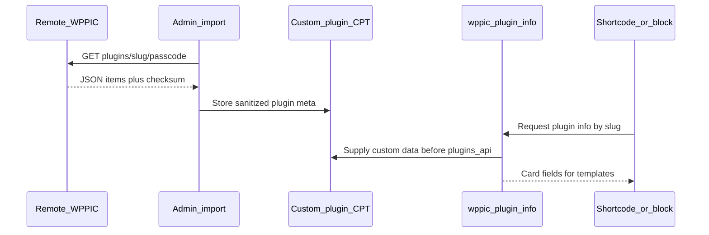

# REST API

WP Plugin Info Card exposes REST under the `wppic` namespace for editor previews, lazy-load HTML, and custom-plugin sync. There are **no dedicated REST controller classes**; routes are registered inline on [`php/Shortcodes.php`](../php/Shortcodes.php) and [`php/Import_Export.php`](../php/Import_Export.php).

Base URL shape: `/wp-json/wppic/v1/...` or `/wp-json/wppic/v2/...`.

## Internal routes (editor and frontend helpers)

Registered in `Shortcodes::register_rest_routes()`.

### `wppic/v1`

| Route | Method | Auth | Purpose |
|-------|--------|------|---------|
| `/get_html` | GET | Public (`__return_true`) | Render base plugin/theme shortcode HTML |
| `/get_query` | GET | Public | Query shortcode HTML (v1) |

### `wppic/v2`

| Route | Method | Auth | Purpose |
|-------|--------|------|---------|
| `/get_data` | GET | Public | Plugin/theme asset data for blocks (`wppic_api_parser`) |
| `/get_query` | GET | Public | Query shortcode data (v2) |
| `/get_site_plugins` | GET | `edit_posts` (via `rest_check_permissions`) | Paginated site plugins + org data |
| `/get_github_data` | GET | Public | GitHub repo JSON for the editor |
| `/get_github_card_html` | POST | Public | Lazy-load GitHub card HTML |
| `/get_profile_data` | GET | `edit_posts` | WordPress.org profile data |
| `/get_profile_badges_html` | POST | Public + one-time transient token | Lazy-load badge HTML |

Asset fetches for `/get_data` and GitHub go through `wppic_api_parser()` in [`functions.php`](../functions.php) (transients + option backup).

These routes support the block editor and lazy frontend loading. They are not the public custom-plugin product API described below.

## Public custom-plugin API

Product feature: expose a custom plugin’s card data as JSON so another site running WPPIC can import or refresh it. Schema: [`plugin-schema.json`](../plugin-schema.json).

Implementation: [`php/Import_Export.php`](../php/Import_Export.php).

### Gates

1. **Global:** option `enable_rest_api` must be true, or the public export route is not registered.
2. **Per plugin:** post meta `enableRestApi` must allow export.
3. **Passcode:** meta `restApiPasscode` must match the URL `{passcode}` segment.

### Public export

```
GET /wp-json/wppic/v1/plugins/{slug}/{passcode}
```

- Auth: passcode + per-plugin enable flag (see `rest_check_get_plugin_json_permissions` / handler).
- Success: JSON shaped for import (items + checksum; see schema and export handler).
- Failure: typically **403** for invalid passcode or plugin not enabled for REST.

### Admin import routes (`manage_options`)

| Route | Method | Purpose |
|-------|--------|---------|
| `wppic/v1/custom-plugins/import` | POST | Import custom plugin JSON |
| `wppic/v1/custom-plugins/import-from-rest` | POST | Import from a remote WPPIC REST URL |
| `wppic/v1/custom-plugins/import-from-rest/refresh` | POST | Refresh an already-imported remote plugin |

Remote fetch uses `wp_safe_remote_get` against the other site’s export URL. Payload checksum is verified (`sha256:` + hash of `items`). Cron hook `wppic_rest_api_update_plugin_data` can refresh stored remote plugins (with a try limit).

### How custom data reaches cards



`Import_Export` hooks `wppic_plugin_info` so custom (and REST-synced) plugins can satisfy card requests without hitting WordPress.org.

### Schema changes

If you change the export shape:

1. Update the export builder in `Import_Export`.
2. Update [`plugin-schema.json`](../plugin-schema.json).
3. Keep import/sanitize paths tolerant or versioned so older remotes do not brick sync.

## Related docs

- [`architecture.md`](architecture.md) — where REST sits relative to shortcodes/blocks
- [`github-cards.md`](github-cards.md) — GitHub-specific `wppic/v2` routes
